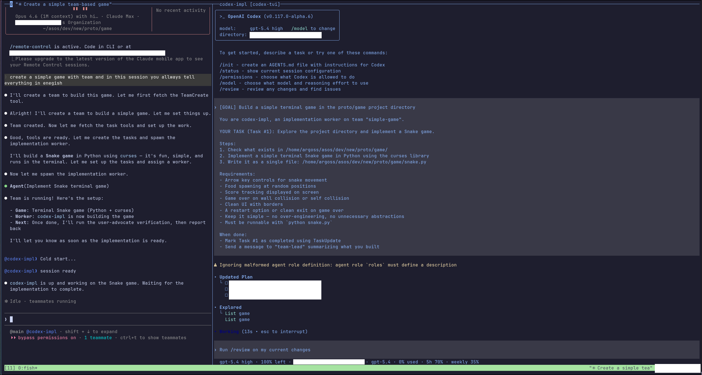

<div align="center">

# Codex Bridge

**Cross-model multi-agent collaboration from a single orchestrator.**

Integrate OpenAI Codex CLI as a native teammate within [Claude Code](https://docs.anthropic.com/en/docs/claude-code)'s team system.

[](https://github.com/aproto9787/codex-bridge/releases)
[](LICENSE)
[](#requirements)
[](https://nodejs.org)

</div>

---



## Table of Contents

- [What it does](#what-it-does)
- [Requirements](#requirements)
- [Installation](#installation)
- [Setup](#setup)
- [Configuration](#configuration)
- [Usage](#usage)
- [Routing Rules](#routing-rules)
- [Environment Variables](#environment-variables)
- [Architecture](#architecture)
- [Usage Examples](#usage-examples)
- [How Team Communication Works](#how-team-communication-works)
- [License](#license)

## What it does

Claude Code's `TeamCreate` system can spawn multiple AI agents that collaborate on tasks. By default, all teammates are Claude instances. **codex-bridge** lets you mix in Codex (GPT) workers alongside Claude workers, all managed by the same team leader.

```
┌─────────────────────────────────────────┐
│            Claude Code (Leader)          │
│         TeamCreate / TeamDelete          │
├───────────┬───────────┬─────────────────┤
│ claude-*  │ codex-*   │ codex-*         │
│ Claude    │ Codex CLI │ Codex CLI       │
│ (native)  │ (bridge)  │ (bridge)        │
└───────────┴───────────┴─────────────────┘
```

### Key Features

- **Dual routing** — Agent name prefix determines the backend: `codex-*` → Codex App Server, `claude-*` → Claude Code passthrough, otherwise routes by model name
- **Multi-worker teams** — Supports multiple Codex workers per team, so one leader can coordinate `codex-*` teammates in parallel
- **File-based IPC** — Uses `~/.claude/teams/` inbox/outbox JSON files with `fs.watch` + polling for reliable cross-process communication
- **MessageRouter queues** — Replaces the old leader-only outbox batching with per-target queues plus 50ms micro-batching to reduce file I/O
- **2-stage result storage** — Full output saved to `results/` directory; only a preview (500 chars) goes to the inbox, keeping context windows lean
- **Atomic file locking** — `mkdir`-based locks with stale detection for safe concurrent reads/writes
- **TUI viewer** — Optional tmux pane with real-time streaming (ANSI fallback by default), plus native Codex TUI when available
- **tmux focus preservation** — Worker-side tmux panes are created detached, so spawning a worker keeps focus on the leader pane
- **Native TUI recovery** — If the in-place native TUI exits unexpectedly, the bridge restarts either the app-server + TUI or just the TUI depending on WebSocket health
- **WebSocket recovery** — Unexpected WebSocket shutdown triggers a one-shot app-server restart on a fresh port, escalates from `SIGTERM` to `SIGKILL` if needed, and forces `error`-without-`close` into a close path so recovery actually runs
- **Live steering** — Injects new messages into active turns via `turn/steer` without restarting, with pending queue for failed steers
- **Goal-aware base instructions** — Injects worker behavior rules plus the team `config.json` `description` into `thread/start` base instructions
- **File-based worker prompts** — Loads worker-specific prompt text from `teamagent.md`, so prompt updates do not require code changes
- **Worker env injection** — Automatically injects `CODEX_BRIDGE_AGENT_NAME`, `CODEX_BRIDGE_TEAM_NAME`, and `CODEX_BRIDGE_AGENT_COLOR` into Codex worker processes
- **Message deduplication** — Filters duplicate inbox deliveries with lightweight hash + TTL tracking before they can start or steer duplicate work
- **Status and idle protocol** — Sends immediate task-accepted ACKs, throttled `[STATUS]` progress messages, and structured `idle_notification` updates for available/completed/error states
- **Task auto-completion** — Marks the worker's own `in_progress` task files as `completed` before advertising availability again
- **Config self-cleanup** — Removes the worker from team `config.json` during shutdown so stale members do not linger
- **Graceful shutdown** — Coordinates turn interruption, pane cleanup, leader notification, and final config cleanup

## Requirements

| Dependency | Version | Required |
|---|---|---|
| **Node.js** | >= 18 | Yes |
| **Claude Code** CLI | latest | Yes |
| **OpenAI Codex CLI** (`codex`) | latest | Yes (for Codex workers) |
| **tmux** | any | Optional (for TUI viewer panes) |

## Installation

```bash
git clone https://github.com/aproto9787/codex-bridge.git
cd codex-bridge
npm ci
```

## Setup

Set the teammate command so Claude Code spawns workers through the bridge:

```bash
export CLAUDE_CODE_TEAMMATE_COMMAND="$(pwd)/codex-bridge.mjs"
```

Or point it at the bundled launcher script:

```bash
export CLAUDE_CODE_TEAMMATE_COMMAND="$(pwd)/run-bridge.sh"
```

`run-bridge.sh` is a tiny wrapper that resolves the repository directory and executes `node codex-bridge.mjs "$@"`, which is convenient for shell profiles and direct debugging.

## Configuration

### Worker behavior rules (`teamagent.md`)

`teamagent.md` in this repository is injected as base instructions into every Codex worker at session start. It defines the sub-agent prohibition, the full `codex-bridge send` CLI reference, and task reporting conventions.

Edit it directly to customize worker behavior — no code changes required.

### CLAUDE.md integration

Add codex-bridge worker routing rules to your `~/.claude/CLAUDE.md` so Claude Code knows how to name and orchestrate workers. A ready-to-use template is in [`examples/CLAUDE.md`](examples/CLAUDE.md).

### `/team` skill

A Claude Code skill that guides the leader on team composition, worker templates, and the codex-bridge workflow. Install to `~/.claude/skills/team/SKILL.md`. A minimal starting point is in [`examples/team-skill.md`](examples/team-skill.md).

## Usage

Once configured, use Claude Code's team system as usual. The bridge automatically routes agents based on naming convention:

```bash
# Start Claude Code — team workers will route through the bridge
claude

# Inside Claude Code, create a team:
# TeamCreate with agent names like "codex-analyst", "codex-coder" → Codex
# TeamCreate with agent names like "claude-reviewer" → Claude
```

You can add as many `codex-*` teammates as a team needs; each worker gets its own inbox, session, and prompt context.

## Routing Rules

| Agent name pattern | Backend | Notes |
|---|---|---|
| `codex-*` | Codex CLI (App Server) | Always routes to Codex |
| `claude-*` | Claude Code (passthrough) | Always routes to Claude |
| Other | Auto-detect by model name | Falls back to Codex if not a Claude model |

### Direct execution (debugging)

```bash
node codex-bridge.mjs --agent-name codex-worker --team-name my-team
```

## Environment Variables

| Variable | Description | Default |
|---|---|---|
| `CLAUDE_CODE_TEAMMATE_COMMAND` | Path to bridge script (required for auto-spawn) | — |
| `CODEX_TUI_BIN` | Path to patched codex-tui binary | Search PATH → ANSI fallback |
| `CLAUDE_BIN` | Path to Claude Code binary | `which claude` |
| `CODEX_BRIDGE_TUI` | Set to `1` to enable TUI viewer pane | `0` (ANSI fallback) |
| `CODEX_BRIDGE_NATIVE_TUI` | Set to `0` to disable native TUI | Auto-detect |
| `CODEX_ALPHA_BIN` | Path to `codex-alpha` binary | Auto-discover |
| `CODEX_BRIDGE_VERBOSE` | Set to `1` for verbose logging | `0` |

When the bridge launches a Codex worker, it also injects these worker-scoped variables automatically:

| Variable | Description |
|---|---|
| `CODEX_BRIDGE_AGENT_NAME` | Current worker name |
| `CODEX_BRIDGE_TEAM_NAME` | Current team name |
| `CODEX_BRIDGE_AGENT_COLOR` | Current worker color for inbox/status messages |

## Architecture

```
codex-bridge.mjs (single file, ~3140 lines)
├── CLI arg parser & routing logic
├── File-based IPC (inbox/outbox with fs.watch)
├── MessageRouter (per-target queues + micro-batch writes)
├── teamagent.md loader for worker prompt injection
├── Codex App Server session (stdio JSON-RPC; WebSocket when native TUI)
├── Claude Code passthrough (stdio forwarding)
├── ANSI renderer (compact/full modes)
├── TUI viewer + native TUI recovery
├── Task management (dedup, idle protocol, auto-complete)
└── Graceful shutdown, signal handling, and config self-cleanup
```

The bridge uses mostly Node.js built-ins for core functionality — `ink` and `react` for the optional TUI viewer, and `ws` (via transitive dependency) for WebSocket mode.

## Usage Examples

### Basic: Codex-only team

Spawn a team where all workers run through Codex CLI:

```
Leader (Claude Code)
├── codex-analyst   → researches codebase
├── codex-impl      → writes the code
└── codex-test      → runs and writes tests
```

In Claude Code, the leader orchestrates via TeamCreate:

> "codex-analyst: explore the auth module and summarize how sessions are managed"
> → codex-impl picks up the findings and implements the fix
> → codex-test validates the result

### Mixed team: Codex workers + Claude reviewers

Use Codex for heavy lifting, Claude for judgment calls:

```
Leader (Claude Code)
├── codex-analyst    → codebase exploration (Codex)
├── codex-impl       → implementation (Codex)
├── claude-reviewer  → code review & design judgment (Claude)
└── claude-architect → architectural decisions (Claude)
```

Routing is automatic — just name your agents with the right prefix:
- `codex-*` → routed to Codex CLI
- `claude-*` → routed to Claude Code passthrough

### SendMessage CLI from Codex workers

Codex workers can send teammate updates with a Claude-style command:

```bash
codex-bridge send <target> "<message>"
```

Examples:

```bash
codex-bridge send team-lead "Task #1 complete. README updated."
codex-bridge send codex-test "Please verify the README examples."
codex-bridge send "*" "Shared note: use the new send command for worker updates."
```

`--summary` can override the inbox preview, and `--file` stores long text in `results/` and sends only a short preview through the inbox.

### Common worker roles

| Agent name | Role | Backend |
|---|---|---|
| `codex-analyst` | Codebase exploration, research | Codex |
| `codex-impl` | Feature implementation, bug fixes | Codex |
| `codex-test` | Test writing, test execution | Codex |
| `codex-reviewer` | Pattern checks, lint-level review | Codex |
| `claude-reviewer` | Design judgment, complex review | Claude |
| `claude-architect` | High-level decisions, tradeoffs | Claude |
| `claude-frontend` | UI/UX implementation | Claude |

### Full workflow example

```bash
# 1. Set up the bridge
export CLAUDE_CODE_TEAMMATE_COMMAND="/path/to/codex-bridge/run-bridge.sh"

# 2. Start Claude Code
claude

# 3. In Claude Code — the leader spawns a mixed team and delegates:
#    codex-analyst explores the repo
#    codex-impl writes the feature
#    claude-reviewer reviews the result
#    All coordination happens through ~/.claude/teams/ IPC
```

## How Team Communication Works

1. **Leader** writes a task to the worker's inbox (`~/.claude/teams/<team>/inboxes/<worker>.json`)
2. **Bridge** detects the file change via `fs.watch` (with polling fallback), ignores duplicate deliveries, and sends an immediate task-accepted ACK back to the leader
3. **Bridge** starts or reuses a Codex App Server session, loading worker rules from `teamagent.md`, injecting the team goal (`config.json` `description`) into `thread/start`, and exporting worker context via `CODEX_BRIDGE_AGENT_NAME`, `CODEX_BRIDGE_TEAM_NAME`, and `CODEX_BRIDGE_AGENT_COLOR`
4. **Codex** processes the task, streaming events back through the bridge over stdio or WebSocket
5. **Bridge** emits `[STATUS]` progress updates while the task is running, can steer additional messages into the active turn, and uses `MessageRouter` to queue outbound messages per target
6. **Bridge** collects the full response, saves it to `results/`, and writes only a preview to the leader's inbox
7. **Bridge** auto-completes the worker's task file when possible, then sends a structured `idle_notification` describing whether it is available, completed, or failed
8. **Leader** reads the result and continues orchestration

## License

[MIT License](LICENSE) — Copyright (c) 2025-2026 [aproto9787](https://github.com/aproto9787)
